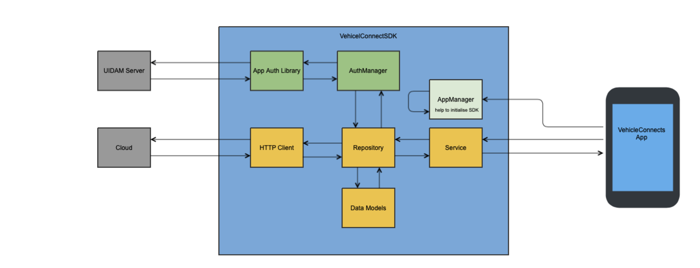

<div align="center">
  
</div>

# Android Vehicle Connect SDK
[](https://github.com/eclipse-ecsp/androidVehicleConnectSDK/actions/workflows/android.yml)
[](https://github.com/eclipse-ecsp/androidVehicleConnectSDK/actions/workflows/license-compliance.yml)

Vehicle Connect SDK provides APIs for user authentication using App Auth library, remote operations, vehicle profile management, and vehicle association. It enables mobile applications to be developed with integrated remote vehicle control functionality.

The Vehicle Connect SDK is written in Kotlin and is compatible with Android 7.0 (API level 24) and above.
It is capable of establishing a connection to the cloud and retrieving both structured model objects and raw response data.


# Table of Contents
* [Getting Started](#getting-started)
* [Usage](#usage)
* [Built with Dependencies](#built-with-dependencies)
* [How to contribute](#how-to-contribute)
* [Code of Conduct](#code-of-conduct)
* [Contributors](#contributors)
* [Security Contact Information](#security-contact-information)
* [Support](#support)
* [Troubleshooting](#troubleshooting)
* [License](#license)
* [Announcements](#announcements)


## Getting Started

Take clone of the project using the command (git clone https://github.com/eclipse-ecsp/androidVehicleConnectSDK.git) and setup android studio and load the project.

Design Overview of VehicleConnectSDK
<div align="center">
  
</div>


Developer documentation:[Developer Doc.zip](./Developer_Doc.zip)


### Prerequisites

The list of tools required to build and run the project:
* Java 1.8
* Android Studio

### Installation

* [Install Android Studio](https://developer.android.com/studio)
* [Install Java 17](https://www.azul.com/downloads/?version=java-17-lts&package=jdk#zulu)

### Coding style check configuration

Check the Coding Guideline document: [Android Coding Guidelines.pdf](./Android.Coding.Guidelines.pdf)

Use android lint for code warnings and errors

### Running the tests

Run the test classes under the folder "app/src/test/java/com/harman/sdkapp"

### Deployment

Clone the project from GitHub, open it in Android Studio, run a Gradle sync, and then perform a rebuild.

* Implement Vehicle Connect SDK Manually:
  1. After a successful build, locate the androidVehicleConnectSDK.aar file in the build/outputs/aar directory and add it to the libs folder of your application project.
  2. Integrate the generated .aar file (added to the libs folder of your application project) by including the following implementation statement in the build.gradle.kts file at the app level.
     
    ```implementation(files("libs/androidVehicleConnectSDK.aar"))```
  
* Implement via Maven central repo:
  1. Get the latest version of [Vehicle connect SDK](https://mvnrepository.com/artifact/org.eclipse.ecsp/vehicleconnectsdk) from Maven central repository
  2. Add the Vehicle Connect SDK dependency to the app level build gradle file using below the statement
     ```implementation("org.eclipse.ecsp:vehicleconnectsdk:1.x.x") // use latest version```

Initialize the SDK by using an instance of the AppManager class.
For detailed information on the implementation and demonstration of SDK API methods, please refer to the [Sample Application](https://github.com/eclipse-ecsp/androidVehicleConnectApp).

## Usage

Developer documentation: [Developer Doc.zip](./Developer_Doc.zip)


## Built With Dependencies

* [AppAuth](https://github.com/openid/AppAuth-Android) - Auth library for User Authentication
* [Retrofit](https://github.com/square/retrofit)- For network operation Management
* [KtLint tool](https://github.com/JLLeitschuh/ktlint-gradle) - Coding convention and style guide


## How to contribute

Please read [CONTRIBUTING.md](https://github.com/eclipse-ecsp/androidVehicleConnectSDK/blob/main/CONTRIBUTING.md) for details on our contribution guidelines, and the process for submitting pull requests to us.

## Code of Conduct

Please read  [CODE_OF_CONDUCT.md](https://github.com/eclipse-ecsp/androidVehicleConnectSDK/blob/main/CODE_OF_CONDUCT.md) for details on our code of conduct, and the process for submitting pull requests to us.


## Contributors

Check here the list of [contributors](https://github.com/eclipse-ecsp/androidVehicleConnectSDK/graphs/contributors) who participated in this project.


## Security Contact Information

Please read [SECURITY.md](./SECURITY.md) to raise any security related issues.

## Support

Contact the project developers via the project's "dev" list - [ecsp-dev](https://accounts.eclipse.org/mailing-list/)

## Troubleshooting

Please read [CONTRIBUTING.md](./CONTRIBUTING.md) for details on how to raise an issue and submit a pull request to us.

## License

This project is licensed under the Apache-2.0 License - see the [LICENSE](./LICENSE) file for details.

## Announcements

All updates to this library are present in our [releases page](https://github.com/eclipse-ecsp/androidVehicleConnectSDK/releases).
For the versions available, see the [tags on this repository](https://github.com/eclipse-ecsp/androidVehicleConnectSDK/tags).
